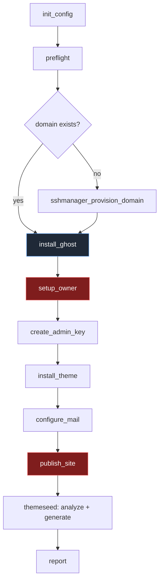

<div align="center">

# 👻 ghostkit

**Stand up a real Ghost site, with your theme on it, in one conversation.**

Provision Ghost on any SSH-reachable Ubuntu host — install a theme, claim the owner
account, mint an Admin API key, wire up email — then hand off to
[themeseed](https://github.com/ThemeAnax/themeseed) to fill it with content that
actually fits the theme.

Ships as an **MCP server** and a **CLI**.

[](https://nodejs.org)
[](https://modelcontextprotocol.io)
[](https://www.typescriptlang.org/)

</div>

---

## Why

Theme development has a boring, repetitive prerequisite: *a Ghost site with real
content on it.* Spinning one up by hand means SSH, Node, ghost-cli, a database, a
reverse proxy, TLS, a process manager, the setup wizard, an integration key, a
theme upload — and then you still have an empty blog.

ghostkit collapses that into a sequence an agent can drive, and it refuses to do
the parts that would quietly bite you later.

```
┌─────────────┐   ┌──────────┐   ┌────────────┐   ┌───────────┐
│  provision  │──▶│  ghost   │──▶│   theme    │──▶│   seed    │
│  (domain)   │   │ + owner  │   │ + activate │   │ (content) │
└─────────────┘   └──────────┘   └────────────┘   └───────────┘
   sshmanager        ghostkit        ghostkit       themeseed
   (or your own)
```

## Quick start

```bash
npx @indianic/ghostkit init      # writes a blank ghostkit.config.json
$EDITOR ghostkit.config.json     # fill it in
npx @indianic/ghostkit preflight # is the host actually ready?
```

As an MCP server:

```jsonc
// ~/.claude.json  →  mcpServers
{
  "ghostkit": {
    "command": "npx",
    "args": ["-y", "--package", "@indianic/ghostkit", "ghostkit-mcp"]
  }
}
```

Then just ask:

> *"Install Ghost on preview.example.com with the theme at `https://…/theme.zip`, seed it with 12 posts, and email me when it's live."*

## Features

- 🔌 **Works with or without infrastructure tooling.** Uses an `sshcon` alias if you
  have one, plain `ssh` if you don't. Never bundles its own key handling.
- 🧪 **One-pass preflight.** Every host requirement checked in a single round trip,
  each failure paired with the command that fixes it — instead of discovering them
  one error at a time.
- 🔒 **Closes the ownership hijack window by construction.** See [Security](#security).
- 🎯 **Picks the right Ghost version for your database.** Won't silently put Ghost 6
  on MariaDB.
- 🚫 **Zero sudo for tenants.** Ghost runs under a `systemd --user` unit with linger,
  so site owners restart their own site without ever touching root.
- 🎨 **Theme-first.** Uploads and activates before seeding, because content should be
  generated against the theme that will display it.
- 📧 **Email that works.** SendGrid for Ghost's transactional mail; completion
  notifications go through the SendGrid API directly, so they arrive even while
  Ghost is restarting.
- 🤝 **Hands off cleanly to themeseed.** Emits an Admin API key in exactly the
  `{id}:{secret}` form it expects.

## The flow



The two red steps are the ones whose **order is load-bearing**. `install_ghost`
binds to loopback only; `publish_site` is what exposes the site to the internet.
Everything that establishes ownership happens between them.

> ghostkit deliberately does **not** call sshmanager itself. MCP servers can't call
> each other — the agent orchestrates. `publish_site` returns the directive block and
> names the tool to apply it with, so ghostkit works fine on a host that has no
> sshmanager at all.

## Security

`POST /ghost/api/admin/authentication/setup/` is **unauthenticated and one-shot**.
Whoever calls it first owns the site.

That makes the naive install order dangerous: if you point DNS and a reverse proxy
at a fresh Ghost and *then* create the owner, there is a window — possibly minutes,
possibly days — in which any stranger who finds the URL can claim your client's blog.

ghostkit closes it structurally:

| Step | Reachable from | Why |
|---|---|---|
| `install_ghost` | `127.0.0.1` only | nothing public exists yet |
| `setup_owner` | `127.0.0.1` + `Host:` header | ownership claimed privately |
| `publish_site` | the internet | site is already owned |

`publish_site` refuses to be smug about it and returns an explicit `warning` if you
call it while the site is still unclaimed.

Other hardening:

- `config.production.json` is set to mode `600`. On ISPConfig hosts the web server
  user is a member of the client group, so the usual `640` would leak the database
  password to Apache.
- Ghost's mail credentials go in an environment file rather than the config JSON,
  which lives under the web-served directory.
- The env file is owned by the **site user**, not root — a `systemd --user` manager
  cannot read a root-only file, and Ghost would start silently mailless.

## Requirements

`preflight` verifies all of this and prints fix commands:

| Requirement | Blocking | Notes |
|---|:--:|---|
| Node | ✅ | `^22.13.1` for Ghost 6, `>=18` for Ghost 5 |
| `ghost-cli` | ✅ | `npm i -g ghost-cli` |
| MySQL 8 or MariaDB | ✅ | determines the Ghost version |
| systemd (`loginctl`) | ✅ | for `--user` units + linger |
| Shell user **not** chrooted | ✅ | see below |
| Outbound SMTP 587 | ⚠️ | warning only |

### Jailkit is a hard blocker

A jailkit chroot has no `XDG_RUNTIME_DIR` and no dbus socket, so `systemctl --user`
cannot work inside one — the site owner could never start or restart their own Ghost.
Set **Chroot = None** on the shell user. ghostkit refuses to continue otherwise
rather than installing something the owner cannot operate.

## Database support

Ghost's position is unambiguous: *"MySQL 8 is the only supported database in
production."* MariaDB works in practice for Ghost 5 and is explicitly unsupported.

`site.ghost_version: "auto"` therefore reads the engine:

| Detected | Installs | Behaviour |
|---|---|---|
| MySQL 8 | **Ghost 6** | fully supported |
| MariaDB | **Ghost 5** | works; `ghost update` emits a notice |

Ask for Ghost 6 on MariaDB explicitly and `preflight` returns a `conflict` instead
of doing it.

## Email

Ghost splits mail in two, and the distinction matters:

| Kind | Examples | SendGrid? |
|---|---|:--:|
| **Transactional** | member signup + login links, staff invites, password resets | ✅ |
| **Bulk** | newsletters to members | ❌ **Mailgun only** |

`configure_mail` wires up transactional mail via SendGrid. If your sites will ever
send newsletters, plan for Mailgun — Ghost does not support anything else for bulk.

## Tools

| Tool | Does |
|---|---|
| `init_config` | Write a blank config; list what still needs filling |
| `config_status` | Report remaining blank fields |
| `preflight` | Host readiness matrix + fix commands + version resolution |
| `install_ghost` | Install Ghost on a loopback port under `systemd --user` |
| `setup_owner` | Claim ownership via the one-shot Setup API (idempotent) |
| `create_admin_key` | Create a custom integration → `{id}:{secret}` |
| `install_theme` | Download zip → upload → activate |
| `configure_mail` | SendGrid env file + restart |
| `publish_site` | Return Apache directives; the agent applies them |
| `report` | Summary + optional notification email |

## Configuration

```jsonc
{
  "site": {
    "domain": "preview.example.com",
    "title": "My Preview",
    "ghost_version": "auto"        // "auto" | "5" | "6"
  },
  "server": {
    "sshcon_alias": "server8",     // preferred, if you use sshcon
    "host": "", "user": "root",    // otherwise plain ssh
    "port": 22, "ssh_key_path": "",
    "ispconfig_server_id": null
  },
  "owner": {
    "name": "Jane Doe",
    "email": "jane@example.com",
    "password": "at-least-ten-chars"
  },
  "theme":    { "zip_url": "https://…/theme.zip", "activate": true },
  "database": { "name": "", "user": "", "password": "" },   // blank ⇒ generated
  "mail": {
    "sendgrid_api_key": "SG.…",
    "from": "noreply@example.com",
    "notify_on_complete": "you@example.com"
  },
  "seed": { "enabled": true, "post_count": 12 }
}
```

## Gotchas worth knowing

<details>
<summary><strong>Never <code>INSERT</code> a Ghost user directly</strong></summary>

A fresh Ghost ships a **fixture Owner** row (`ghost@example.com`, status `inactive`)
already mapped to the Owner role. The Setup API *updates* that row. Inserting your
own user leaves two owners and a broken role mapping. Always use the API.
</details>

<details>
<summary><strong>Admin API keys need the "Admin Integration" role</strong></summary>

Not `Administrator`. Wrong role, and the key authenticates but is refused on most
endpoints.
</details>

<details>
<summary><strong><code>--process local</code> is mandatory at install</strong></summary>

`--no-setup-systemd` only skips *creating* the unit; it leaves `"process": "systemd"`
in the config. Every subsequent `ghost` command then shells out to
`sudo systemctl …` — which hangs forever on a password prompt the site owner cannot
answer. Under a tty it doesn't even fail, it spins.
</details>

<details>
<summary><strong><code>ghost ls</code> will say "stopped" — ignore it</strong></summary>

Ghost-CLI's `local` process manager has no visibility into the `systemd --user` unit.
Trust `systemctl --user is-active ghost`.
</details>

<details>
<summary><strong>Use the update wrapper, not <code>ghost update</code></strong></summary>

Ghost-CLI's process manager and the systemd unit would both try to bind the same
port. `ghost-safe-update` stops the unit, updates with `--no-start`, restarts it.
</details>

<details>
<summary><strong>Never proxy <code>/.well-known/</code></strong></summary>

Proxy it and Let's Encrypt renewals fail silently about 60 days later. The emitted
directive block excludes it.
</details>

## Development

```bash
npm install
npm run build       # tsc → dist/
npm run dev         # watch mode
```

Probe the MCP server directly:

```bash
printf '%s\n%s\n%s\n' \
 '{"jsonrpc":"2.0","id":1,"method":"initialize","params":{"protocolVersion":"2024-11-05","capabilities":{},"clientInfo":{"name":"probe","version":"1"}}}' \
 '{"jsonrpc":"2.0","method":"notifications/initialized"}' \
 '{"jsonrpc":"2.0","id":2,"method":"tools/list"}' \
 | node dist/mcp/index.js
```

## Related

- [themeseed](https://github.com/ThemeAnax/themeseed) — reads the active theme and
  generates content that fits it
- [Ghost](https://ghost.org) · [Ghost-CLI docs](https://ghost.org/docs/ghost-cli/)
- [Model Context Protocol](https://modelcontextprotocol.io)

## License

MIT © [ThemeAnax](https://github.com/ThemeAnax)
